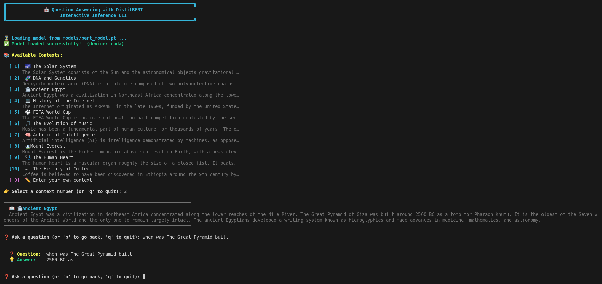

# 🤖 Question Answering with Transformers

A question answering system built with **DistilBERT**, fine-tuned on the **SQuAD 2.0** dataset. Given a context passage, the model extracts the most relevant span of text that answers a user's question.

## Demo

<p align="center">
  
</p>

## Project Structure

```
├── main.py              # Training entry point
├── inference.py          # Interactive inference CLI
├── SQuAD_Dataset.py      # PyTorch Dataset for SQuAD 2.0
├── data_preprocess.py    # Tokenization & data preprocessing
├── trainer.py            # Training & validation loop
├── utils.py              # Evaluation & helper functions
├── config.json           # Hyperparameters & paths
├── models/
│   └── bert_model.pt     # Fine-tuned model weights
├── data/
│   ├── train-v2.0.json   # SQuAD 2.0 training set
│   └── dev-v2.0.json     # SQuAD 2.0 dev set
└── Assets/
    └── Inference.png     # CLI screenshot
```

## How It Works

1. **Preprocessing** — Questions and contexts are tokenized using the DistilBERT tokenizer with a sliding window (stride) to handle long passages.
2. **Training** — The model is fine-tuned to predict the start and end token positions of the answer span within the context.
3. **Inference** — The model outputs start/end logits, which are mapped back to character offsets in the original text to extract the answer string.

## Setup

### Requirements

- Python 3.8+
- PyTorch
- Transformers (Hugging Face)
- Datasets
- Evaluate
- NumPy

### Installation

```bash
pip install torch transformers datasets evaluate numpy
```

## Usage

### Training

```bash
python main.py
```

Trains the model using the settings defined in `config.json` and saves the weights.

### Inference

```bash
python inference.py
```

Launches an interactive CLI where you can:

- **Pick a context** from 10 built-in topics (Solar System, DNA, Ancient Egypt, AI, and more)
- **Enter your own context** by selecting option `0`
- **Ask questions** and get answers extracted by the model in real time
- Type `b` to switch contexts or `q` to quit

## Configuration

All hyperparameters are in `config.json`:

| Parameter              | Default                  | Description                       |
| ---------------------- | ------------------------ | --------------------------------- |
| `checkpoint`           | `distilbert-base-uncased`| Base model architecture           |
| `tokenizer_max_length` | `512`                    | Max token sequence length         |
| `tokenizer_stride`     | `128`                    | Sliding window stride             |
| `BATCH_SIZE`           | `2`                      | Training batch size               |
| `lr`                   | `2e-5`                   | Learning rate                     |
| `epochs`               | `2`                      | Number of training epochs         |
| `n_best`               | `20`                     | Top-N predictions to consider     |
| `max_answer_length`    | `30`                     | Max answer span length in tokens  |

## Dataset

This project uses [SQuAD 2.0](https://rajpurkar.github.io/SQuAD-explorer/) (Stanford Question Answering Dataset), which contains 100,000+ question-answer pairs based on Wikipedia articles, including unanswerable questions.
